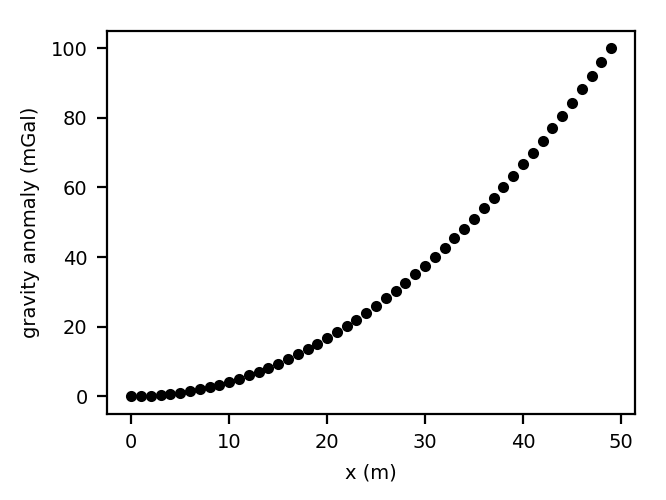

# {{ cookiecutter.title }}

by 
[{{ name }}]({{ cookiecutter.authors[name] }}), 

A paper with our results has been submitted for publication in
*{{ cookiecutter.journal }}*.

**Insert a brief description of what this paper is about (2-3 sentences).**

> Caption for the summary figure.
> It's good to add a figure that summarizes the main results of the paper.

The files in this repository are organized in the following folders:

* `code`: All source code (including [Jupyter notebooks][jupyter]) used to
  generate the results and figures.
* `data`: The data used in this study.
* `results`: The outputs produced by this study (data, models, intermediate
  results, etc).
* `manuscript`: Latex sources for the manuscript text.
* `figures`: Figures (mostly generated by the code) and used in the manuscript.

See the `README.md` files in each directory for a full description.

Most calculations and figure generation are all run inside
[Jupyter notebooks][jupyter].
You can view a [static (non-executable) version of the notebooks](
http://nbviewer.jupyter.org/github/{{ cookiecutter.github_user }}/{{ cookiecutter.repository }}).
For posterity, we provide read-only PDF versions of the notebooks.

See the sections below for instructions on executing the code and reproducing
out results.

## Abstract

Paste the abstract here.

## Reproducing the results

### Getting the files

You can download a copy of this project by cloning the
[git][git] repository:

    git clone https://github.com/{{ cookiecutter.github_user }}/{{ cookiecutter.repository }}.git

or [click here to download a zip archive](https://github.com/{{ cookiecutter.github_user }}/{{ cookiecutter.repository }}/archive/master.zip).

### Setting up your environment

You'll need a working Python **{{ cookiecutter.python }}** environment with the
standard scientific packages installed (numpy, scipy, matplotlib, etc).
The easiest (and recommended) way to get this is to download and install the
[Anaconda Python distribution][anaconda].

We use the `conda` package manager (included in Anaconda) to create a virtual
environment with all of the required dependencies.
The configuration for the environment is specified in the file
`environment.yml`.
To create the environment, open a terminal and run the following command in the
repository root (where `environment.yml` is located):

    conda env create

This will create an environment called `{{ cookiecutter.repository }}` and
download and install all required dependencies, including Python itself.

Activate the environment by running:

    source activate {{ cookiecutter.repository }}

or, if you're on Windows using `cmd.exe`:

    activate {{ cookiecutter.repository }}

This will enable the environment for your current terminal session.
After activation, all commands will run inside the environment using the
specified versions of the dependencies.

**Windows users:** It is highly recommended that you install the bash shell
to run code and produce the results here.
You can download [a bundled version of git and bash for Windows][gitbash]
or (recommended) install the [official Ubuntu/bash on Windows][winubuntu].

### Running the code

To execute the code in the Jupyter notebooks, you must first start the
notebook server.
Open an terminal and run the following inside the repository folder (remember
to activate your `conda` environment first):

    jupyter notebook

This will start the server and open your default web browser to the Jupyter
interface. In the page, go into the `code` folder and select the
notebook that you wish to view/run.

The notebook is divided into cells (some have text while other have code).
Each cell can be executed using `Shift + Enter`.
Executing text cells does nothing and executing code cells runs the code
and produces it's output.
To execute the whole notebook, run all cells in order.

All results figures in the paper are generated by the
`code/generate_figures.ipynb` notebook.

## License

All source code is available under a BSD 3-clause license. You can freely
use and modify the code, without warranty, so long as you provide attribution
to the authors.

Unless otherwise specified, all data generated by this project is licensed
under a [Creative Commons Attribution 4.0 International License][ccby]. You are
free to use, share, and adapt the data so long as you provide attribution to
the authors.

The manuscript text is not open source. The authors reserve the rights to the
article content, which is currently submitted for publication in
{{ cookiecutter.journal }}.

See `LICENSE.md` for the full license text.

[git]: https://git-scm.com
[ccby]: http://creativecommons.org/licenses/by/4.0/
[jupyter]: http://jupyter.org
[anaconda]: http://continuum.io/downloads#all
[gitbash]: http://git-for-windows.github.io
[winubuntu]: https://msdn.microsoft.com/commandline/wsl/about
